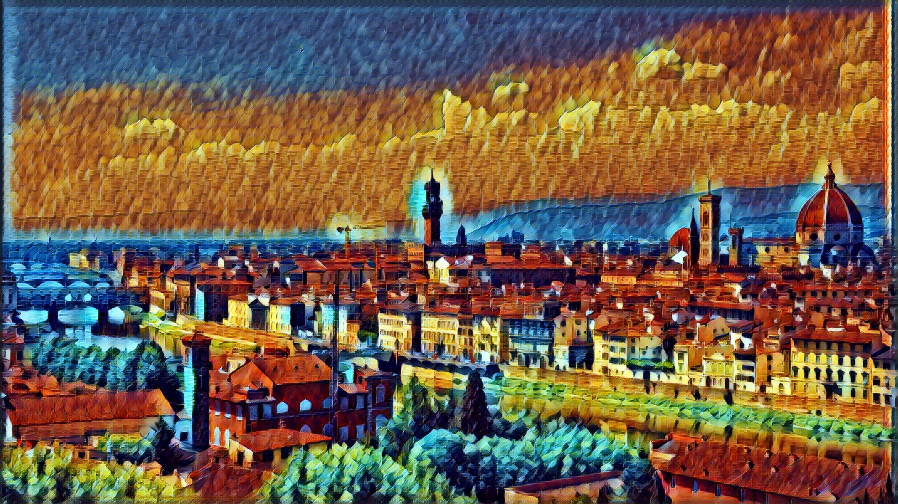
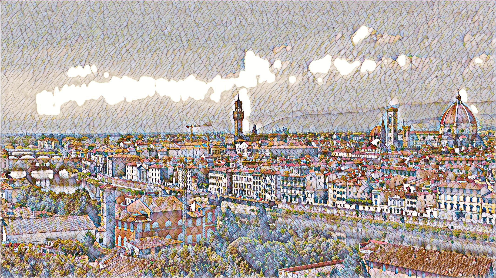
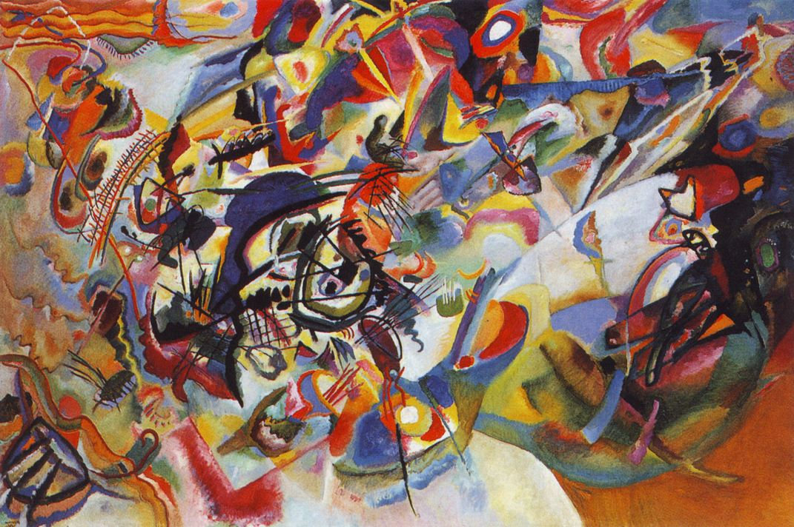
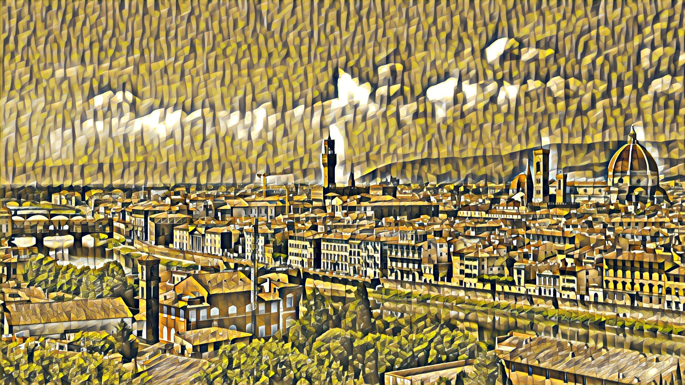
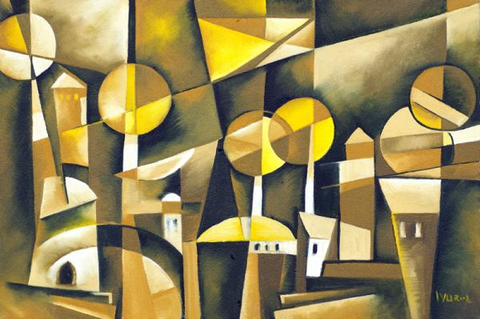
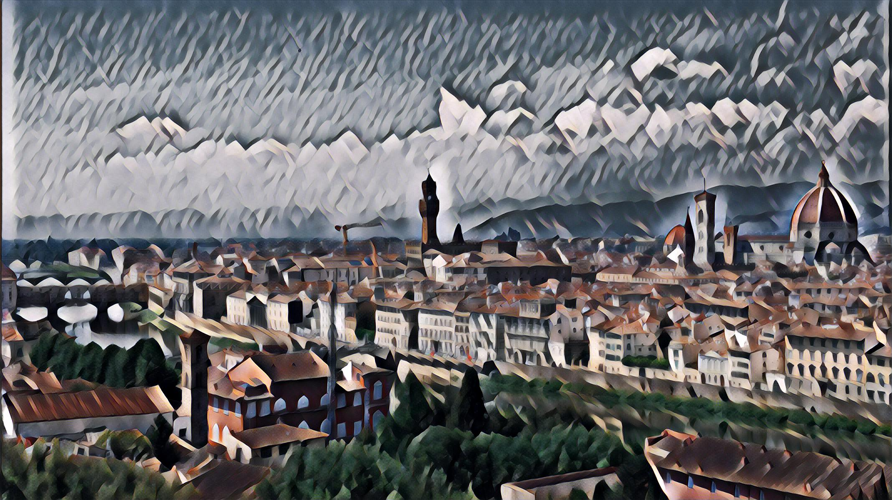
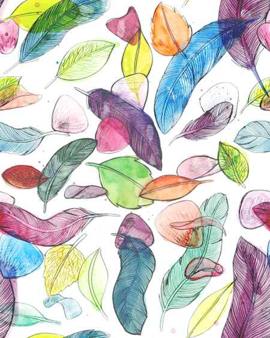

# MeuralPaint
Paint images using famous artistic styles in seconds (or less!) 

`quickpaint` using pre-trained styles (models) or `trainstyle` a new model on a new style

a TensorFlow implementation for feed forward CNN fast neural style transfer, based on  [1-3].  

works with different versions of pre-trained TF models

## Examples 

| | input |   |
|:-----:|:-------:|:-----:|

| styles | examples | examples | styles  |
|:-----:|:-------:|:-----:|:-------:|
|  rain princess  |  |  | the shipwreck of the minotaur  |
|  wave  |  |  | mosaic  |
|  the scream  |  |  | composition vii  |
|  la muse  |  |  | cubist  |
|  udnie  |  |  | feathers  |

## Usage

### QuickPaint

**Command line**:

python `quickpaint.py` -i [ input (content) ] -o [ output (stylized content) ] -m [ model (style) ] 

Example: python `quickpaint.py `-i inputs/stanford.jpg -o outputs/stanford_cubist.jpg -m pre-trained_models/cubist.model

required arguments:  
 ` -i, --input ` dir or file to transform (content)  
 ` -o, --output` destination (dir or file) of transformed input (stylized content)  
`  -m, --model ` path to load model (.ckpt or .model/.meta) from

optional arguments:  
  `-h, --help        `    show this help message and exit   
 ` -d , --device     `    device to perform compute on (default: /gpu:0)   
`  -b , --batch-size `    batch size for feed-forwarding (default: 4)   
 ` -a , --model-arch `    model architecture if models in form (.model) are used, (default: pre-trained_models/model.meta)

### TrainStyle

## Dependencies

- Python 2.7.9
- TensorFlow 0.11.0 >=
- scipy 0.18.1  
- numpy 1.11.2

#### To train:

 1) COCO dataset (training data)
 http://msvocds.blob.core.windows.net/coco2014/train2014.zip
 
 2) VGG19 imagenet weights 
 http://www.vlfeat.org/matconvnet/models/beta16/imagenet-vgg-verydeep-19.mat

## Acknowledgements 

- Implementation based on fast-style-transfer: https://github.com/lengstrom/fast-style-transfer
by lengstrom (engstrom at mit dot edu)

- TF vgg network from: https://github.com/anishathalye/neural-style

- Pre-trained models acquired from: 
    1) https://drive.google.com/drive/folders/0B9jhaT37ydSyRk9UX0wwX3BpMzQ
    2) https://github.com/junrushao1994/fast-neural-style.tf/tree/master/models   

## References

[1] Johnson, Justin, Alexandre Alahi, and Li Fei-Fei. "Perceptual losses for real-time style transfer and super-resolution." arXiv preprint arXiv:1603.08155.
https://arxiv.org/abs/1603.08155

check out Justin's repo for a theano/Lua implementation: https://github.com/jcjohnson/fast-neural-style

[2] Ulyanov, Dmitry, Andrea Vedaldi, and Victor Lempitsky. "Instance Normalization: The Missing Ingredient for Fast Stylization." arXiv preprint arXiv:1607.08022.
https://arxiv.org/abs/1607.08022

[3] Gatys, Leon A., Alexander S. Ecker, and Matthias Bethge. "A neural algorithm of artistic style." arXiv preprint arXiv:1508.06576.
https://arxiv.org/abs/1508.06576 
